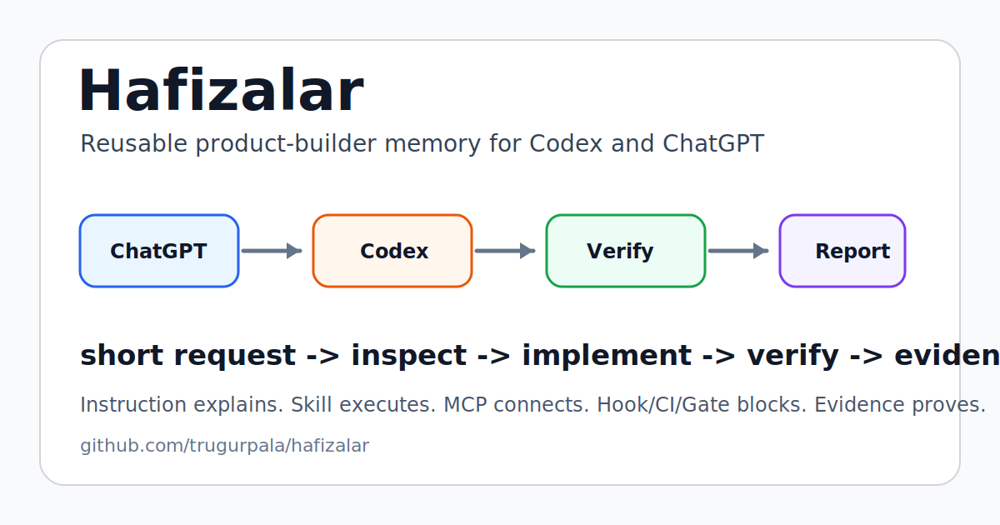

# Hafizalar

[](https://github.com/trugurpala/hafizalar/actions/workflows/test.yml)
[](LICENSE)
[](package.json)

Hafizalar is a reusable product-builder operating memory for Codex and ChatGPT.

It is not the name of the product you are building. It is the discipline that turns a short, messy request into inspected, implemented, verified software.



```text
short request -> inspect repo -> choose one path -> implement -> verify -> report
```

Core rule:

```text
Instruction explains. Skill executes. MCP connects. Hook/CI/Gate blocks. Evidence proves.
```

## What You Get

| Surface | File | Use it for |
| --- | --- | --- |
| Codex full contract | `HAFIZALAR-CODEX.md` | Local repo work, edits, tests, build/debug, GitHub source work. |
| Codex short contract | `HAFIZALAR-CODEX-SHORT.md` | Compact sessions where the full contract is too large. |
| ChatGPT contract | `HAFIZALAR-CHATGPT.md` | Planning, review, product writing, prompt shaping, compact handoff to Codex. |
| Project templates | `templates/` | Task tracking, review notes, golden path, project setup. |
| Installer | `scripts/install-hafizalar.mjs` | Copy Hafizalar into any project without overwriting existing files by default. |

## 60-Second Install

Clone and verify Hafizalar:

```powershell
git clone https://github.com/trugurpala/hafizalar.git
cd hafizalar
npm.cmd test
```

Dry-run install into your project:

```powershell
npm.cmd run install:hafizalar -- --target C:\path\to\project --surface both --dry-run
```

Install:

```powershell
npm.cmd run install:hafizalar -- --target C:\path\to\project --surface both
```

Windows wrapper:

```powershell
powershell -NoProfile -ExecutionPolicy Bypass -File scripts\install-hafizalar.ps1 -Target C:\path\to\project -Surface both
```

Installed files go under:

```text
<project>/.hafizalar/
<project>/HAFIZALAR.md
<project>/TASKS.md
<project>/REVIEW.md
<project>/docs/GOLDEN-PATH.md
<project>/docs/PROJECT-SETUP.md
```

The installer does not overwrite existing files unless you pass `--force`.

## Choose A Surface

Use ChatGPT when the work is product thinking, architecture, writing, review, UI direction, or a compact handoff.

Use Codex when the work needs local repo inspection, file edits, tests, build logs, screenshots, GitHub source changes, or proof.

Codex and ChatGPT have separate practical limits. Do not assume a ChatGPT upload/model/tool banner applies to Codex, and do not assume Codex remaining usage means ChatGPT uploads or Agent mode are available.

Read: [`docs/OPENAI-SURFACE-LIMITS.md`](docs/OPENAI-SURFACE-LIMITS.md)

## Documentation

| Doc | Purpose |
| --- | --- |
| [`docs/INSTALLATION.md`](docs/INSTALLATION.md) | Full install, update, force, verify, and troubleshooting guide. |
| [`docs/USAGE.md`](docs/USAGE.md) | Daily Codex + ChatGPT workflow and handoff templates. |
| [`docs/DIAGRAMS.md`](docs/DIAGRAMS.md) | Mermaid diagrams and FigJam visual handoff link. |
| [`docs/GITHUB-REPO-CHECKLIST.md`](docs/GITHUB-REPO-CHECKLIST.md) | Repo quality checklist for keeping the public project current. |
| [`docs/MAINTENANCE.md`](docs/MAINTENANCE.md) | Release, source-refresh, and evidence routine. |
| [`docs/FIGMA-HANDOFF.md`](docs/FIGMA-HANDOFF.md) | Figma/FigJam visual system notes. |

## GitHub Community Surface

This repo includes:

- CI on Ubuntu and Windows with Node 22 and Node 24,
- issue templates,
- pull request template,
- Dependabot config,
- support and security notes,
- MIT license,
- tested installer,
- repo graphics and diagrams.

## Test

Run:

```powershell
npm.cmd test
```

or:

```powershell
powershell -NoProfile -ExecutionPolicy Bypass -File scripts/test-hafizalar.ps1
```

The tests verify required files, contract anchors, README links, template presence, ASCII portability, installer dry-run behavior, real sandbox install behavior, and no obvious secret-shaped text.

## Status

Community repo: ready.

GitHub Actions: active.

Release/package publish: not performed.
