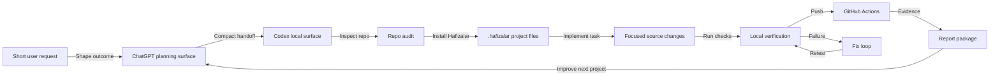
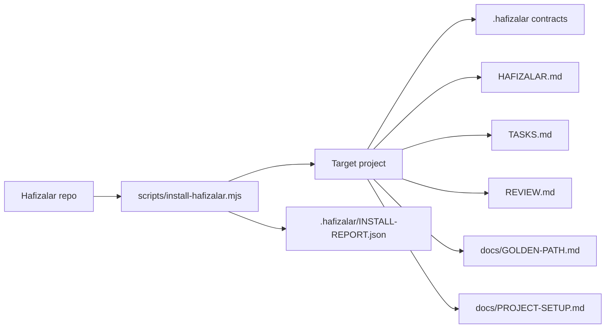
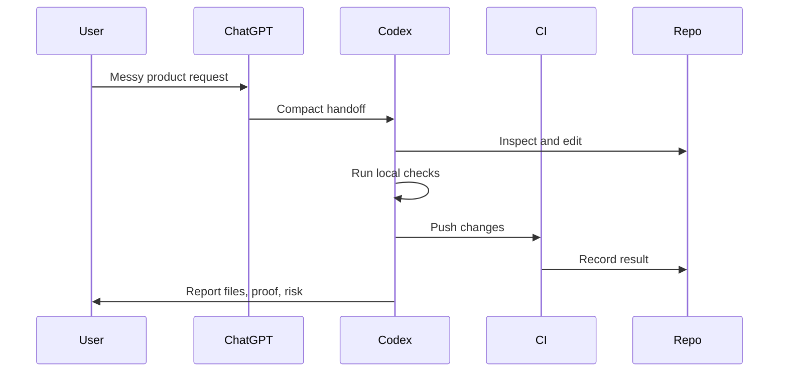

# Diagrams

This page is the repo-native visual source for Hafizalar.

FigJam diagram:

https://www.figma.com/board/7dd9CaDt2kOUSjf06j36JJ?utm_source=codex&utm_content=edit_in_figjam&oai_id=&request_id=63af9a57-a475-465b-9f89-6ef40fe4150d

## Product Builder Flow



## Installer File Map



## Evidence Loop



## Social Card

Repo card asset:

```text
assets/brand/hafizalar-repo-card.svg
```

Use it as GitHub social preview or in docs when a visual summary is needed.
